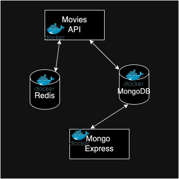

## Docker Assignment - Agile Software Practice.

__Name:__ Futong Zhu

__Demo:__ [View Demo](https://youtu.be/P1hBpJoGZtY)

This repository contains the containerization of the mukti-container application illustrated below.



### Project Structure
```
.
├── .dockerignore        # Specifies files to ignore in Docker builds
├── .env.dev             # Environment variables for the development setup
├── .env.prod            # Environment variables for the production setup
├── .gitignore           # Specifies intentionally untracked files to ignore
├── docker-compose.yml   # Defines and configures the application's services
├── Dockerfile           # Instructions for building the application's Docker image
├── package.json         # Defines npm dependencies for the Node.js application
├── package-lock.json    # Provides version information for all packages installed
├── README.md            # Provides project documentation
├── seed.js              # Script for seeding the MongoDB database
└── seeding.json         # JSON file containing initial data for seeding
```

### Database Seeding.
The database seeding process is automated using a `seed.js` script that populates MongoDB with initial data from `seeding.json`. This script is configured to run automatically when the MongoDB container is set up, ensuring that the database is immediately ready for use upon deployment.

### Multi-Stack.
This project supports both development and production stack options by utilizing different `.env` files which tailor the environment variables to suit each scenario:
- **Development Stack**: Configured for testing and development purposes, using non-production data and settings that enable debugging and detailed logging.
- **Production Stack**: Optimized for performance and security with settings that enhance application efficiency and safeguard operations.

### Getting Started
1. Clone the repository to your local machine.
2. Navigate to the project directory.
3. Start the application using the appropriate environment configuration:
   - **Development Environment**:
     ```bash
     docker-compose --env-file .env.dev up --build
     ```
   - **Production Environment**:
     ```bash
     docker-compose --env-file .env.prod up --build
     ```
4. Access the services:
   - **Movies API**: `http://localhost:9000/`
   - **Mongo Express**: `http://localhost:8081/`

### Using Redis for Caching
Redis is pre-configured to cache API responses, significantly reducing load times and database query frequency for frequently accessed data.

